# Rendered mockups — high-fidelity previews

These SVGs are rendered from a **real ratatui framebuffer** by
[`crates/rocm-dash-tui/examples/gen_mockups.rs`](../../../crates/rocm-dash-tui/examples/gen_mockups.rs):
real box-drawing, the real `Theme` palette (`ui/theme.rs`), and the real
`GradientGauge` / `BrailleSparkline` instrument widgets — exported with the same
buffer→SVG technique as the production `gen_screenshots` tool. They are the
pixel-accurate counterpart to the annotated wireframes in the surface docs.

> The example is a **design sketchbook**: it paints the proposed layouts without
> touching the live `ui::draw` path, so we can review the redesign before
> committing it into product code.

## Regenerate

```bash
cargo run --release --example gen_mockups -p rocm-dash-tui -- \
    --output-dir docs/design/mockups
```

This (re)writes every `*.svg` here plus `index.html` (a local gallery — open it
in a browser to see all scenes on one page).

---

## Surface 2 — bare `rocm` minimal launcher

Single screen, live status strip on top, icon menu, one focused row. Modeled on
the `ccstatusline` pattern. See [surface-2-minimal.md](../surface-2-minimal.md).

**Model running** — context-aware copy names the live model:

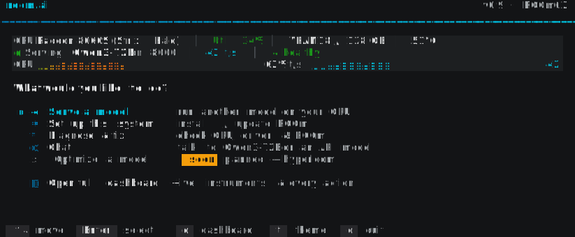

**Idle** — greyed rows teach the unlock step instead of disappearing (F114/F126):

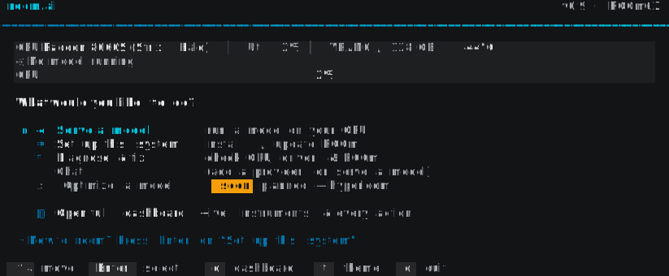

---

## Surface 3 — `rocm dash` full control room

Outlined folder tabs (active = cyan, bottom edge open into the panel). See
[surface-3-dash.md](../surface-3-dash.md).

**Home** — bento landing: a hero GPU **instrument cluster** (utilization gauge +
braille traces for util, tokens/watt, VRAM, temp, power, and throughput),
context-aware Next-step card, Running / Health / Updates tiles. Gradient traces
(green→amber→red) read load; cyan traces read throughput:

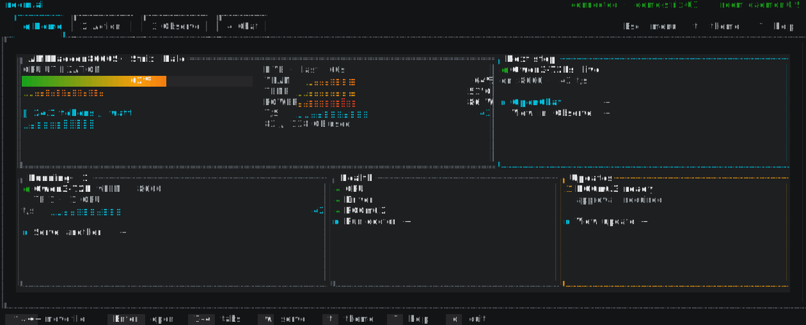

**Action** — every guided/mutating workflow as a visible tile + plain-English
detail pane; mutations are approval-gated:

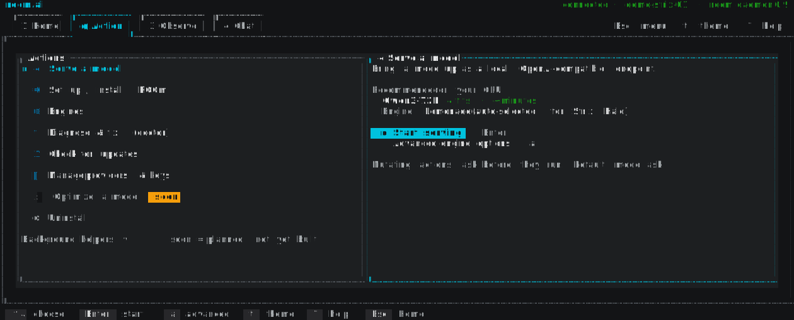

**Observe** — a full 3×2 braille **instrument cluster** (util, temp, power, VRAM,
tokens/watt, throughput) plus per-instance and per-bench traces, item-action
rows, demo-data banner, attribution badge, on-screen glyph legend:

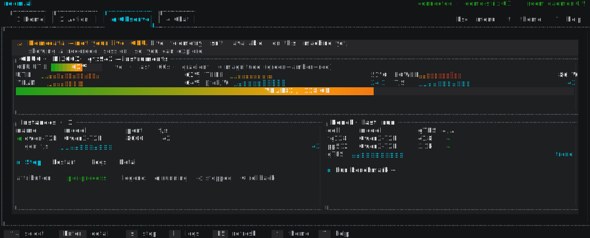

**Chat** — the agent with a visible `✦ Plan this` chip and approval review cards:

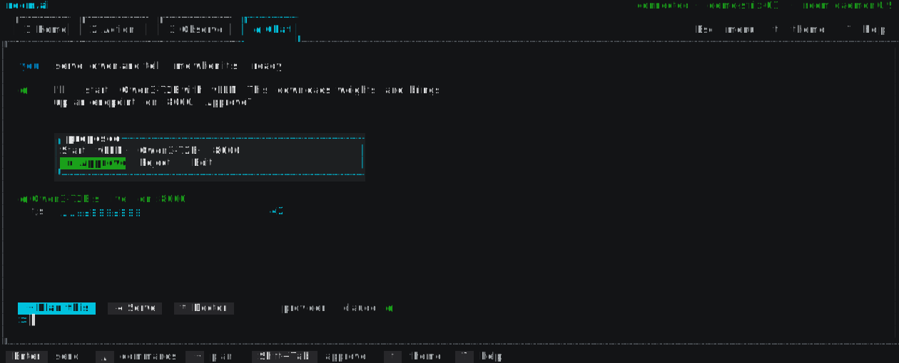

**Command palette (`:`)** — the universal navigable launcher overlay (rescues
F263 + the whole slash cluster):

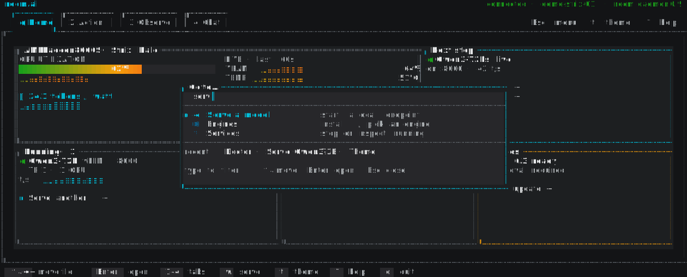

**Theming** — the same Home landing under `tokyo-night`, proving the palette
retints the whole surface (15 themes already exist, F111/F259):

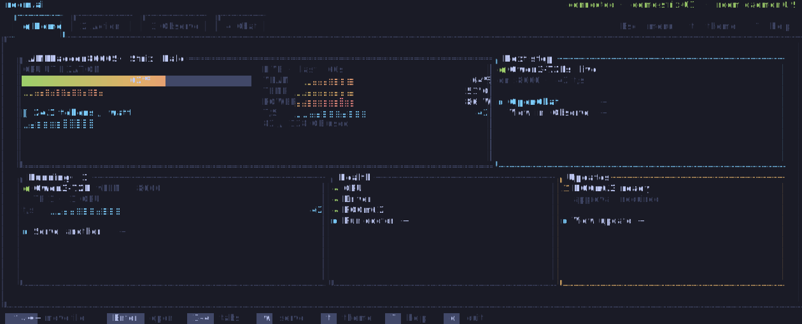

---

## Global chrome — Esc menu, Options, Help

`Esc` brings up a **btop-style main menu**: a big gradient block "ROCM" logo over
a grey-dimmed backdrop, with a vertical **Options / Help / Quit** list (↓ cycles).
The header chrome advertises `Esc menu · t theme · ? help`.

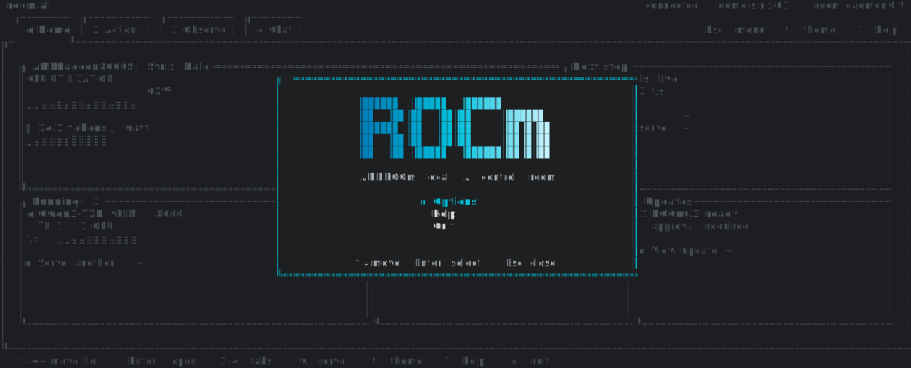

**Options** — a tabbed settings panel (General · CPU · GPU · Engines). Each row is
a toggle (`● / ○`), a cycle (`◂ ▸`), or an action (`→`):

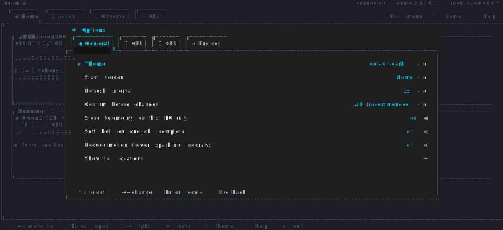

**Help** — a two-column keyboard reference, grouped (Navigate · Overlays ·
Actions · Chat · Global):

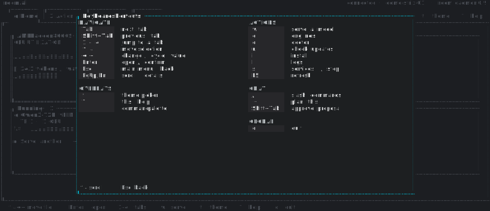

---

## Responsive — Wide layout (15″+ laptop / 27″ external)

The scenes above are the **Compact** layout (13–14″ laptop). On a wide terminal
the dash reflows from *sequential* (tabs + overlays) to *simultaneous* — a
**triptych command center**: a persistent GPU instrument wall (left), the
tab-driven workspace (center), and an always-on assistant dock (right). Rendered
at 220 × 54. Full rationale and breakpoints in
[../responsive.md](../responsive.md).

**Home (wide)** — the flagship triptych: 4-GPU wall, node throughput hero,
status bento, and an activity feed:

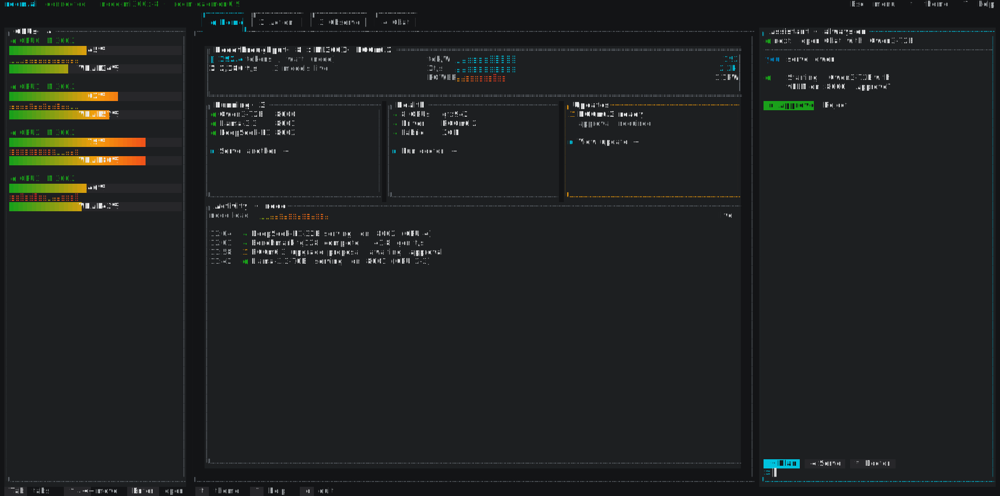

**Observe (wide)** — the GPU wall scales to all **8 GPUs** of the node, and the
instances table + selected-instance detail are visible at once (no Enter-to-reveal):

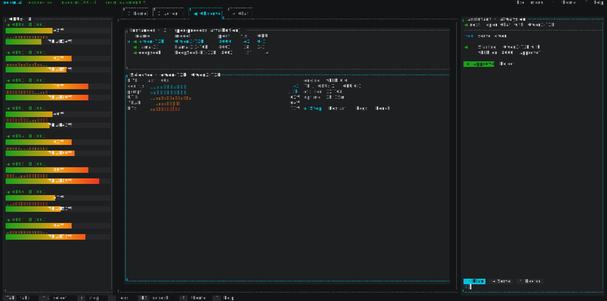

**Action (wide)** — the actions list and the fully-expanded serve wizard sit side
by side; everything the compact layout reveals step by step is visible together:

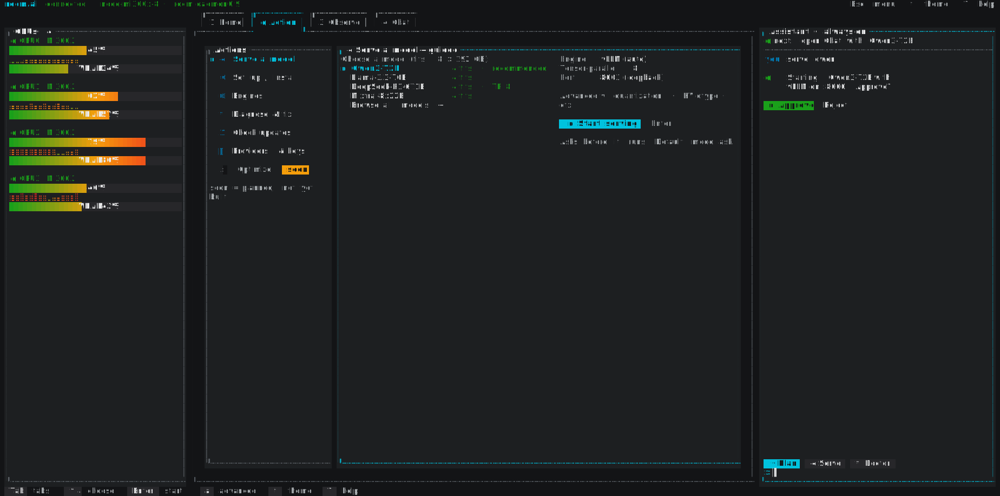

**Chat (wide)** — the conversation expands to fill the center (multi-step plan,
live throughput trace, chips, composer); the right dock becomes a **context rail**
showing exactly what the MCP-grounded agent can see — live services, GPU state,
recent tool calls, active skills:

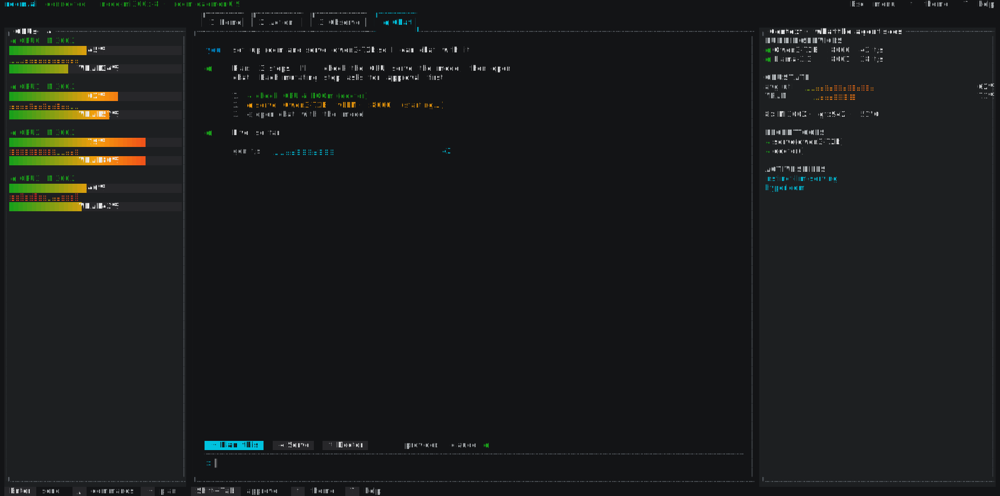

**Observe (wide) — contextual dock** — the right dock isn't fixed to the
assistant. On a focused observe task it can become a **live logs stream** for the
selected service (same left wall + center master-detail):

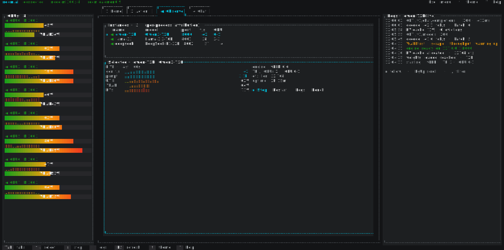
